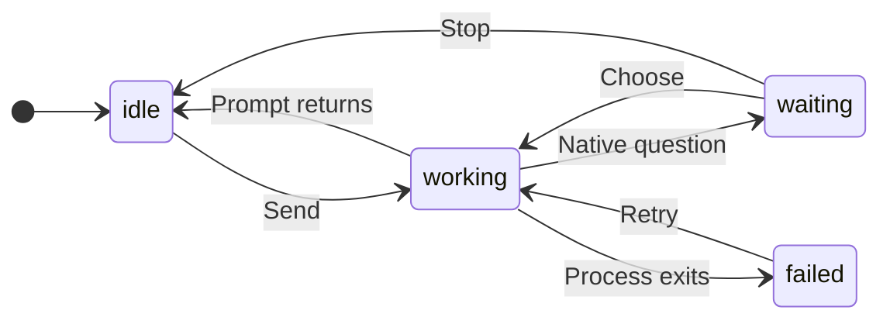

# UX: Read Claude through its ordinary terminal and transcript

## 1. Why

Alex wants the tmux plugin to submit messages and read replies without telling Claude that GeckIt is managing the conversation. Remove the plugin's HTTP hooks and appended system instructions. Preserve native permissions and subscription authentication. Existing conversation history and user-authored instructions can still reveal automation; the transport cannot promise undetectability.

## 2. Affected surfaces

| Surface | Behavior | When visible |
| --- | --- | --- |
| Existing transcript | Replies arrive when Claude appends its JSONL file | Claude produces a message |
| Existing question card | Claude's native terminal question and choices | A native numbered selection needs input |
| Existing board status | Working, waiting for an answer, finished or failed | The terminal changes state |
| Existing Stop button | Sends Ctrl+C to the native terminal | User presses Stop |

No new UI components or styling. Native choices use the existing question card rather than pretending that GeckIt's former permission grants still apply.

## 3. States

| State | Trigger | Visible result | User action |
| --- | --- | --- | --- |
| Working | Message submitted or terminal shows work | "Working - sending to Claude Code", then "Working - waiting for Claude Code" and appended reply/tool items | Wait or Stop |
| Waiting | Terminal displays a selectable numbered question | Native question and exact choice labels | Choose an option |
| Finished | Recognized idle input prompt after observed turn activity | Last answer; existing finished notification | Read or send a follow-up |
| Stopped | Ctrl+C followed by native idle state | Existing "Stopped" state | Send another message |
| Failed | Claude process exits during a turn or submission fails | Existing failure with concrete detail | Retry |

## 4. Transitions

| From | Event | To | Visible result |
| --- | --- | --- | --- |
| Idle | User sends a message | Working | "Working" |
| Working | Poll detects a native selection, automatically | Waiting | Native title and exact choices |
| Waiting | User chooses a currently displayed option | Working | Card folds; native keyboard selection |
| Waiting | Native selection changes outside GeckIt, automatically | Waiting/Working | Old card resolves; new card if needed |
| Working | Idle input prompt returns after turn activity, automatically | Idle | Existing finished state |
| Working/Waiting | User presses Stop and terminal returns to idle | Idle | "Stopped" |
| Working | tmux pane/process disappears, automatically | Failed | "Claude Code exited." |

## 5. Quiet states

Polling, file offsets and terminal inspection produce no user messages. Unknown terminal layouts remain working: elapsed silence alone never means completion. No hook endpoint, bearer token or app-specific system prompt is given to Claude.

## 6. Timing

| Threshold | Value | Reason |
| --- | --- | --- |
| Typing interval | 30 ms per character | Submit prompts through ordinary terminal typing |
| Poll interval | 500 ms | Preserve existing transcript cadence without per-token reads |
| Idle confirmation | Two consecutive polls after observed activity | Avoid a transient prompt during redraw or submission |
| Process check | Every four polls | Detect missing sessions and retained dead panes |
| Idle shutdown | One hour after a finished turn | Keep the terminal available for follow-ups; new sends reset the timer, working/approval/background states prevent shutdown |

## 7. Wording

Question title and choices are Claude's native terminal text. Existing app labels remain "Working", "Stopped", and "Claude Code exited.". No new labels that imply guaranteed invisibility.

## 8. Edge cases

- Resume: begin at the old transcript's end; do not replay old answers.
- Multiline text: type a backslash followed by Enter for each line break, then Enter to submit the whole prompt.
- Incomplete JSONL line: retain bytes until its newline arrives.
- Long-running tool or hook: retain Working while native busy indicators remain.
- Fast answer: new transcript data provides turn activity even if no busy screen was sampled.
- Stale question: recapture before answering; never select an option from an obsolete screen.
- Native workspace trust: recognize the exact trust prompt, move to Yes, wait 700 ms for native input to settle, and recapture the screen to confirm Yes is visibly selected before pressing Enter. If startup ignores the navigation key, retry without submitting No, exit.
- Images: preserve temporary image paths and remove files after completion/stop.
- Existing GECKIT.md: exclude only that file per session if verified supported; do not edit shared global instructions.
- Existing conversation: prior messages/system context may already mention GeckIt.
- Synthetic records: No response requested and other non-error placeholders never cause Failed. Only explicitly flagged API errors cause failure; a subsequent real assistant response clears an error after recovery.

## 9. Deliberate omissions

No permission bypass, authentication changes, global setting edits, fabricated tool requests or guaranteed undetectability. No token-level streaming: Claude's saved message blocks are the reply source.

## 10. Decisions

Use tmux input, native terminal selection and passive JSONL reading. Remove HTTP hooks. Completion requires the actual input prompt and turn activity, not a silence timeout. User hooks remain active. Per-session GECKIT.md exclusion avoids changing builtin Claude sessions.

## 11. Acceptance

- Launch arguments contain no GeckIt hooks or appended system prompt.
- First and subsequent multiline prompts reach ordinary Claude input.
- Replies and tool entries reach GeckIt from JSONL.
- Native choices, Stop, resume, trust and image cleanup have focused regression coverage.
- Verification records any unavailable native app review.

## 12. Verification

- Node syntax checks and all three focused tests pass. Integration covers multiline first/follow-up input, no hooks or source prompt, environment filtering, resume offset, working silence, idle-before-activity, unknown layout, native denial and stale choices, custom answers, partial UTF-8 JSONL, local slash commands, image cleanup, explicit trust selection after an ignored startup key, Stop and process exit.
- Native Claude Code 2.1.294 passed an end-to-end driver test: trust confirmation, PONG from JSONL, idle completion, follow-up Red/Blue question, selecting Blue and completion. Its idle prompt, working spinner without interrupt hints and numbered question match the parser. Native `/memory` comparison shows GECKIT.md in the baseline session and absent with per-process exclusion; other user/project instructions remain.
- GeckIt Local computer access was denied by Computer Use. Full-window light/dark, keyboard/focus, scrolling and viewport review of its existing question cards is unavailable. No frontend components or styles changed.
- Unknown layouts stay working rather than reporting completion; native dialogs outside numbered menus require terminal interaction.

## 13. Rollout

Install or update the library through Settings > Libraries. Apply update loads the new provider without restarting GeckIt; existing active turns finish with their current driver. Later sends adopt the replacement provider. The driver remains open for one hour after a completed turn, with new messages resetting the idle timer.

### Plan-limit refresh

The first limits request reads `/usage` to initialize the existing usage display. Later requests read `/usage` only after a message was successfully submitted through this provider since the previous check began, and the randomized 15-30 minute cooldown has elapsed. Ordinary sends and Send now deliveries count after the terminal accepts Enter. Queued, rejected or failed sends do not count. Messages submitted during a check remain eligible for the next check. A failed check retains cached limits and requires another message before a later attempt.

Without new messages, polling returns remembered limits without terminal interaction, even after the cooldown. Remembered reset times still roll forward locally. Transcript limit events update remembered values without scheduling a check. These transitions are silent; the existing usage display, wording and layout remain unchanged. This replaces elapsed-time-only refreshes to avoid repeated checks while the provider is unused.

Regression coverage uses fake Claude in an isolated real tmux server: initial read, no-message polling after the cooldown, sent-message refresh, retained messages during a check, concurrent requests, local reset rollover, transcript limit updates, failed checks, failed startup, ordinary sends and accepted/rejected injections. No frontend files or styles change; native visual review is not part of this terminal-only fix.

### Diagnostic audit

The host logger records `usage.command.sent` after `/usage` is submitted, and check-start/outcome/skip events with IDs, new-message counts and next allowed check time. Session/turn events and successful-send counts include no conversation content. Missing logging on an older host remains silent and does not change execution. See GeckIt's `docs/ux/plugin-logs.md` for shared file storage and inspection behavior.

## 14. Synthetic-message regression

The resumed native probe transcript wrote No response requested with isApiErrorMessage false immediately before a user's Hi and a normal assistant reply. The first passive driver incorrectly classified every synthetic record as a failure. Failure detection now requires isApiErrorMessage true. A later real assistant response clears an error after recovery. All three tests pass, including benign synthetic, flagged API error and recovered error cases. The regression is covered by the integration test.
